# JFXLEGACY2MODERN — AI-Powered Legacy Software Modernization Platform

[](#architecture)
[](#ai-agent-platform)
[](#legacy-modernization)
[](#license)
[](#mbse-and-software-architecture)

> **Open-source AI agent architecture for analyzing, refactoring, migrating and modernizing legacy software systems from one development framework, language or architectural paradigm to another.**

---

## Repository Status

This checkout contains a reference README and Draw.io architecture assets. The agents, CLI, deployment manifests and integrations described below are **proposed capabilities**, not verified implementations. Installation and usage commands are illustrative until corresponding code is delivered. The Mermaid diagrams describe the intended design, not a running deployment.

The reference also covers the [reverse-engineering transition with UML and Rascal MPL](docs/enterprise-ai-reference.md#10-transición-desde-ingeniería-inversa-uml-y-mpl).

See the [enterprise architecture and AI-assisted development reference](docs/enterprise-ai-reference.md) for Java, .NET and other open-source ecosystems.

## Table of Contents

- [Description and Context](#description-and-context)
- [Problem Statement](#problem-statement)
- [Objectives](#objectives)
- [Functional Scope](#functional-scope)
- [Enterprise AI Development Reference](docs/enterprise-ai-reference.md)
- [ERP Support, Migration, Upgrades and Low-Code](#erp-support-migration-upgrades-and-low-code)
- [Architecture](#architecture)
- [AI Agent Platform](#ai-agent-platform)
- [Legacy Modernization Pipeline](#legacy-modernization-pipeline)
- [Software Analysis](#software-analysis)
- [Code Transformation](#code-transformation)
- [Architecture Recovery](#architecture-recovery)
- [Target Architecture Generation](#target-architecture-generation)
- [Multi-Agent Modernization](#multi-agent-modernization)
- [Software Dependency Compendium](#software-dependency-compendium)
- [Dependency Classification](#dependency-classification)
- [Dependency Matrix](#dependency-matrix)
- [Recommended Technology Stack](#recommended-technology-stack)
- [MBSE and Software Architecture](#mbse-and-software-architecture)
- [User Guide](#user-guide)
- [Installation Guide](#installation-guide)
- [Docker Architecture](#docker-architecture)
- [Kubernetes Deployment](#kubernetes-deployment)
- [Security](#security)
- [Testing and Validation](#testing-and-validation)
- [Repository Structure](#repository-structure)
- [CI/CD](#cicd)
- [Contribution](#contribution)
- [Code of Conduct](#code-of-conduct)
- [Authors](#authors)
- [Additional Information](#additional-information)
- [License](#license)
- [Roadmap](#roadmap)

---

# Description and Context

**JFXLEGACY2MODERN** is an open-source AI-powered software modernization platform.

Its primary purpose is to automate or assist the migration of legacy software from an existing implementation technology toward a modern target architecture.

The current repository describes the project as an **open-source AI agent that modernizes legacy code from one development framework to another**.

The repository also references technologies and projects related to:

- AI coding agents
- agent-oriented programming
- legacy Java modernization
- automated refactoring
- software architecture recovery
- code quality analysis
- multi-agent systems
- LangGraph
- AutoGen
- OpenHands
- Haystack
- Dify
- JADE
- MBSE
- Arcadia
- Capella
- CAD
- CAM
- CAS

This makes the project suitable as a foundation for a broader **AI Software Modernization Engineering Platform**.

---

# Problem Statement

Legacy systems frequently contain:

- obsolete frameworks
- unsupported dependencies
- outdated programming languages
- monolithic architectures
- tightly coupled modules
- undocumented business rules
- obsolete APIs
- unsupported operating systems
- obsolete build systems
- insufficient test coverage
- architectural drift
- duplicated code
- undocumented integrations

Traditional modernization projects require significant manual effort.

Typical migration activities include:

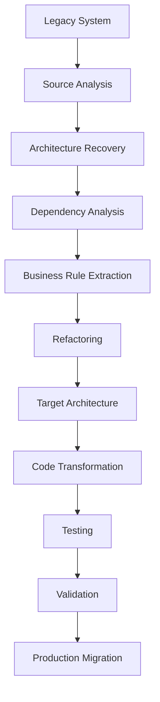

JFXLEGACY2MODERN introduces AI agents into this lifecycle.

---

# Objectives

## Primary Objectives

1. Analyze legacy source code automatically.
2. Recover implicit software architecture.
3. Identify obsolete dependencies.
4. Extract business rules.
5. Detect technical debt.
6. Generate modernization plans.
7. Refactor source code.
8. Translate code between frameworks.
9. Generate target architecture.
10. Generate tests for migrated code.
11. Validate semantic equivalence.
12. Maintain traceability between legacy and modern implementations.

---

# Modernization Philosophy

The platform should follow these principles:

- **Understand before transforming**
- **Preserve business behavior**
- **Automate repetitive transformations**
- **Keep humans in control of architectural decisions**
- **Generate tests before risky transformations**
- **Maintain traceability**
- **Prefer incremental modernization**
- **Support rollback**
- **Measure modernization quality**

---

# Functional Scope

JFXLEGACY2MODERN can support the following capabilities.

## Legacy Code Analysis

- source parsing
- AST generation
- dependency discovery
- call graph generation
- package analysis
- class analysis
- method analysis
- complexity analysis
- code smell detection

## Architecture Recovery

- component identification
- service identification
- dependency graph
- module boundaries
- architectural patterns
- coupling analysis
- cohesion analysis

## AI-Assisted Refactoring

- rename
- extract method
- extract class
- dependency replacement
- API migration
- framework migration
- design pattern transformation

## Framework Migration

Examples:

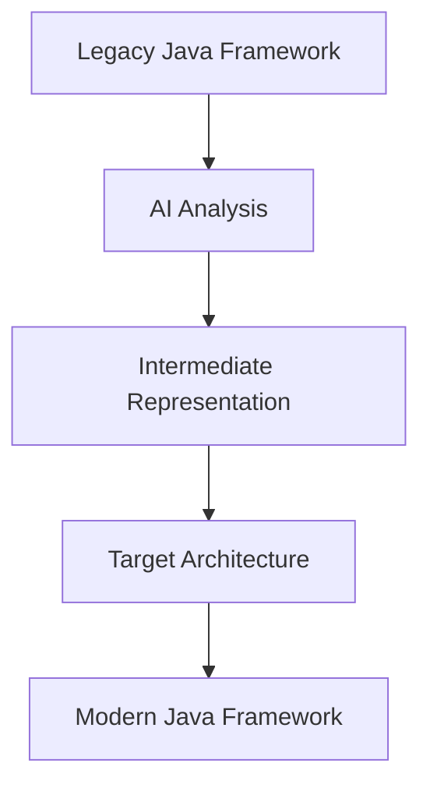

Potential targets:

- Spring Boot
- Quarkus
- Micronaut
- Jakarta EE
- REST APIs
- microservices
- event-driven systems

---

# ERP Support, Migration, Upgrades and Low-Code

The proposed ERP extension covers operational support, cross-product migration and same-product upgrades. Initial reference profiles include Odoo Community, ERPNext, Flectra, Dolibarr, Tryton and iDempiere. Examples distinguish Odoo Community 11.0→15.0, ERPNext 11→15 and Odoo Community 11.0→ERPNext 15; these are planning examples, not validated compatibility claims or a recommendation to deploy historical versions.

The [`erp-modernization`](modules/erp-modernization/README.md) module owns inventory, version-specific adapters/recipes, reconciliation, cutover, rollback and support evidence. The optional [`erp-low-code`](modules/erp-low-code/README.md) module explicitly declares **Frappe as a required external runtime dependency for its low-code profile**, with revision pinning and compatibility still pending. No ERP executor or Frappe app is implemented in this checkout.

See the [ERP specification and requirements](docs/erp-modernization.md), [declarative profiles](modules/erp-modernization/profiles.json) and [editable Draw.io architecture](MBSE/CAS/Drawio/erp-modernization-low-code.drawio).

---

# Architecture

## High-Level Architecture

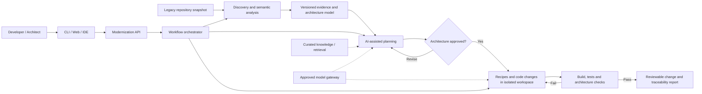

---

# AI Agent Platform

The modernization engine should use multiple specialized agents rather than one monolithic AI agent.

## Agent Roles

### Repository Discovery Agent

Responsibilities:

- inspect repository
- identify programming languages
- identify build tools
- detect frameworks
- identify configuration files
- identify databases
- identify external APIs

### Code Analysis Agent

Responsibilities:

- AST analysis
- dependency analysis
- complexity analysis
- code smell detection
- architectural pattern detection

### Architecture Recovery Agent

Responsibilities:

- generate component diagrams
- generate dependency graphs
- identify architectural layers
- detect monolith boundaries
- identify candidate services

### Business Rule Agent

Responsibilities:

- infer business rules
- identify domain entities
- identify workflows
- identify validations
- identify business constraints

### Modernization Planner Agent

Produces:

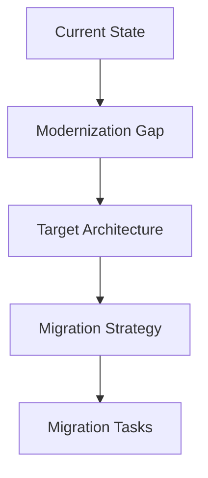

### Code Transformation Agent

Responsible for:

- code translation
- API migration
- framework migration
- dependency replacement
- refactoring

### Test Generation Agent

Generates:

- unit tests
- integration tests
- regression tests
- characterization tests
- contract tests

### Validation Agent

Compares:

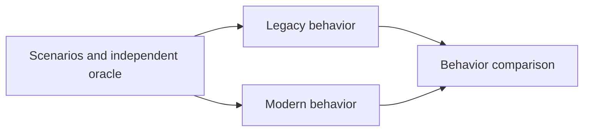

---

# Legacy Modernization Pipeline

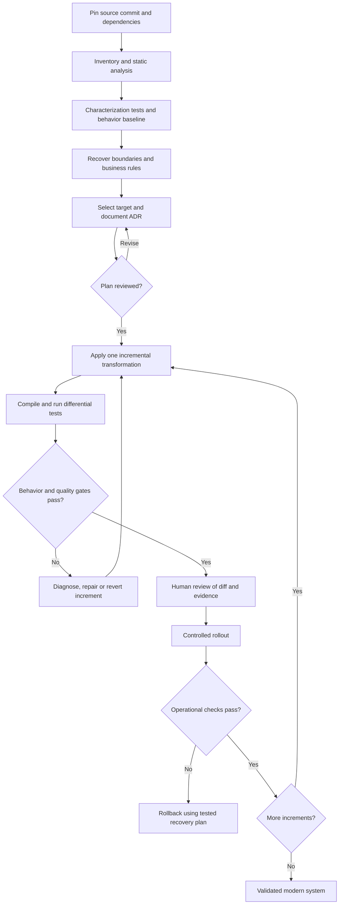

---

# Software Analysis

## Static Analysis

The platform should analyze:

- source files
- AST
- imports
- dependencies
- inheritance
- interfaces
- annotations
- configuration
- build files
- deployment descriptors

## Metrics

Recommended metrics:

| Metric | Purpose |
|---|---|
| Cyclomatic Complexity | Complexity |
| Coupling | Architecture |
| Cohesion | Modularity |
| LOC | Size |
| Duplication | Technical debt |
| Dependency Count | Maintainability |
| Code Smells | Quality |
| Test Coverage | Safety |
| API Usage | Migration complexity |

---

# Architecture Recovery

The platform should reconstruct an architecture model from source code.

Example:

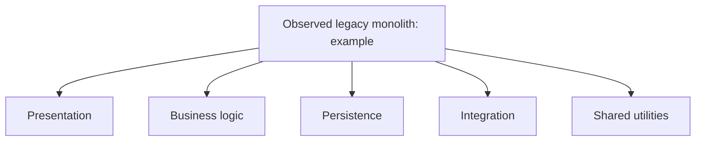

AI can then propose:

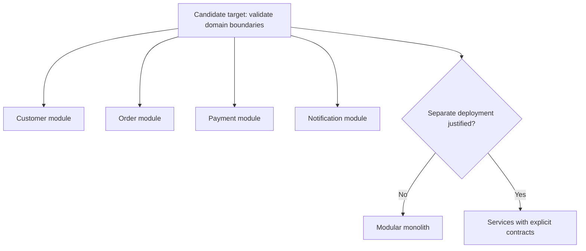

A modular monolith is a valid target; service extraction requires an operational and business justification.

The architecture proposal must remain subject to human architectural approval.

---

# Code Transformation

## Transformation Strategies

### 1. Syntax Transformation

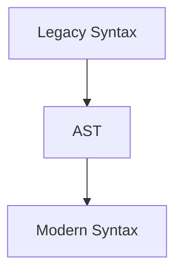

### 2. API Transformation

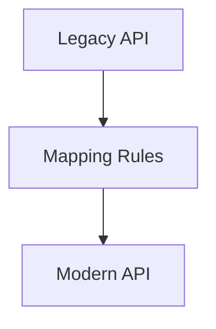

### 3. Framework Transformation

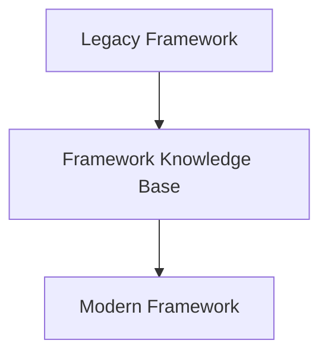

### 4. Architectural Transformation

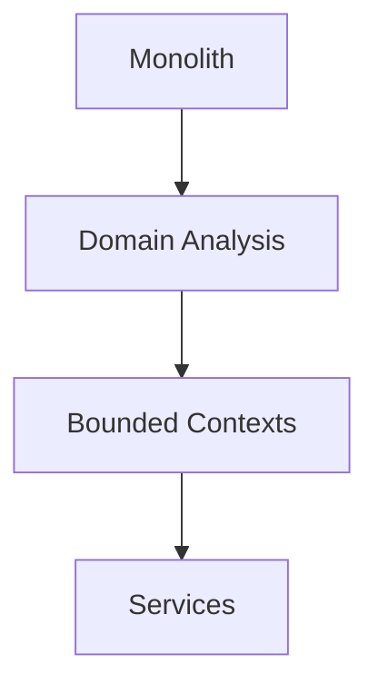

---

# Intermediate Representation

A key architectural capability should be an intermediate software representation. **MPL means Rascal Meta Programming Language in this design.** Rascal is the proposed metaprogramming layer for language-specific ASTs, resolved M3 facts and a project-defined normalized representation independent of concrete syntax. Language semantics and source provenance remain explicit; this is not a universal AST or an implemented integration.

See [Rascal layers, Java/.NET adapters and UML mappings](docs/enterprise-ai-reference.md#106-capas-rascal-árbol-concreto-ast-y-modelo-semántico).

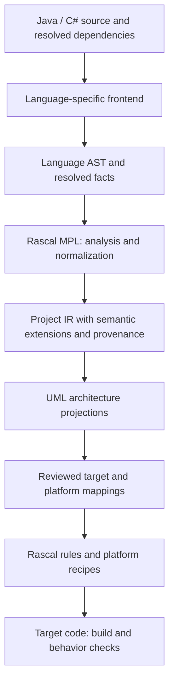

The intermediate model enables multiple source-to-target transformations.

For example:

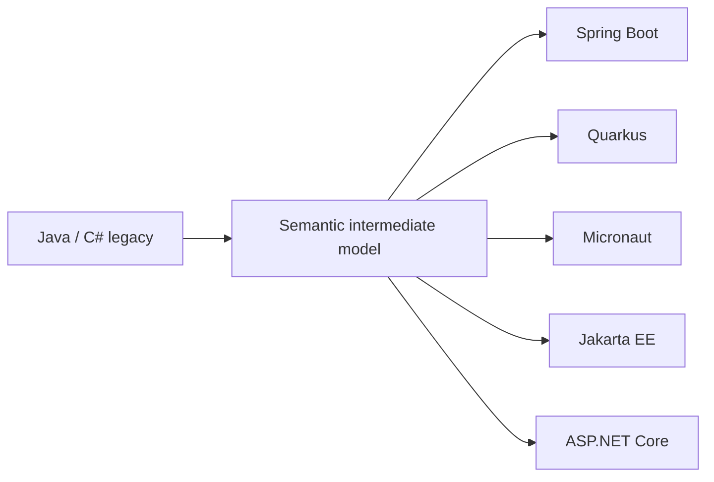

---

# Software Dependency Compendium

The following compendium organizes the technologies referenced by JFXLEGACY2MODERN into functional categories.

The reference template specifically recommends documenting libraries, frameworks, databases, external resources, licenses and tested versions, together with build/runtime requirements and testing procedures.

---

## 1. AI Agent Frameworks

| Technology | Function | Classification |
|---|---|---|
| LangGraph | Stateful agent orchestration | Core |
| AutoGen | Multi-agent applications | Core/Optional |
| OpenHands | Autonomous coding agent | Optional |
| OpenRoom | AI interaction with applications | Research |
| Dify | LLM application platform | Optional |
| Haystack | AI/RAG orchestration | Optional |
| Agent Zero | Autonomous agent framework | Research |
| Uni-Agent | General agent framework | Research |
| SRE | Production AI agent runtime/SDK | Research |

The current repository explicitly references LangGraph, AutoGen, OpenHands, Dify, Haystack, Agent Zero, Uni-Agent and other agent-oriented systems.

---

# 2. AI Coding Agents

Potential components include:

- OpenHands
- OpenCode
- Codex CLI
- Kilo
- VibeCoder
- ReforgeAI
- ScreenCoder
- Warp
- Agent S

These technologies can be used as references or integration candidates for autonomous coding workflows.

---

# 3. Legacy Modernization

The modernization compendium includes:

| Tool | Purpose |
|---|---|
| Legacy2Modern | Legacy modernization |
| Going Merry | Legacy Java migration |
| Coca | Legacy refactoring |
| ReforgeAI | AI Java modernization |
| DesigniteJava | Java architecture/code quality |

These tools can be used for:

- migration analysis
- refactoring
- architectural assessment
- code quality
- modernization benchmarking

The repository explicitly references Going Merry, Coca, DesigniteJava, Legacy2Modern and ReforgeAI.

---

# 4. Source Code Analysis

Recommended technologies:

- Tree-sitter
- Eclipse JDT
- JavaParser
- Spoon
- PMD
- SpotBugs
- Checkstyle
- SonarQube / SonarCloud
- Semgrep
- CodeQL

Capabilities:

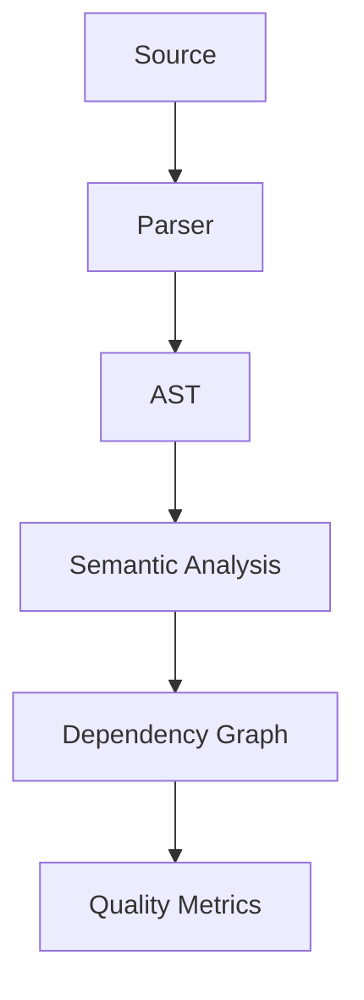

---

# 5. Software Architecture Analysis

Recommended technologies:

- DesigniteJava
- SonarQube
- ArchUnit
- jQAssistant
- Structure101
- Graphviz
- NetworkX

Architecture models can represent:

- dependencies
- packages
- services
- modules
- interfaces
- databases
- APIs

---

# 6. Graph Analysis

Graph technologies:

- NetworkX
- Neo4j
- Graphviz
- Apache TinkerPop

Possible graph types:

```text
Dependency Graph
Call Graph
Class Graph
Package Graph
Service Graph
Data Flow Graph
Architecture Graph
```

---

# 7. LLM Infrastructure

Potential model infrastructure:

| Component | Purpose |
|---|---|
| Ollama | Local LLM execution |
| vLLM | High-performance inference |
| OpenLLM | Model serving |
| Hugging Face Transformers | Model integration |
| llama.cpp | Local inference |
| ONNX Runtime | Optimized inference |
| OpenVINO | Hardware optimization |

---

# 8. Code LLMs

Potential model families:

- Code Llama
- StarCoder
- Qwen-Coder
- DeepSeek-Coder
- Granite Code
- CodeGemma

Selection criteria:

- code generation quality
- context length
- programming-language coverage
- license
- inference requirements
- benchmark performance
- security

---

# 9. RAG and Knowledge Management

Recommended stack:

| Component | Function |
|---|---|
| Qdrant | Vector search |
| PostgreSQL | Structured metadata |
| pgvector | Relational vector search |
| Elasticsearch | Full-text search |
| OpenSearch | Search |
| FAISS | Local vector index |
| Chroma | Development vector DB |

RAG can provide agents with:

- framework documentation
- API migration guides
- legacy code patterns
- architecture standards
- coding rules
- modernization playbooks

---

# 10. Knowledge Graph

A knowledge graph can represent:

```text
Legacy Framework
      │
      ├── Version
      ├── APIs
      ├── Dependencies
      ├── Known Issues
      └── Migration Rules
```

Candidate technologies:

- Neo4j
- NetworkX
- Apache TinkerPop
- RDF
- SPARQL

---

# 11. Software Build Systems

Legacy systems frequently depend on multiple build technologies.

### Java

- Maven
- Gradle
- Ant

### JavaScript

- npm
- Yarn
- pnpm

### Python

- pip
- Poetry
- uv

### .NET

- MSBuild
- NuGet

### C/C++

- CMake
- Make
- Ninja
- Conan
- vcpkg

The modernization agent should automatically detect build systems.

---

# 12. Java Modernization

Java is a primary candidate for modernization.

Recommended tools:

- JavaParser
- Eclipse JDT
- Spoon
- OpenRewrite
- ArchUnit
- Maven
- Gradle
- JUnit
- Mockito
- Testcontainers

Potential transformations:

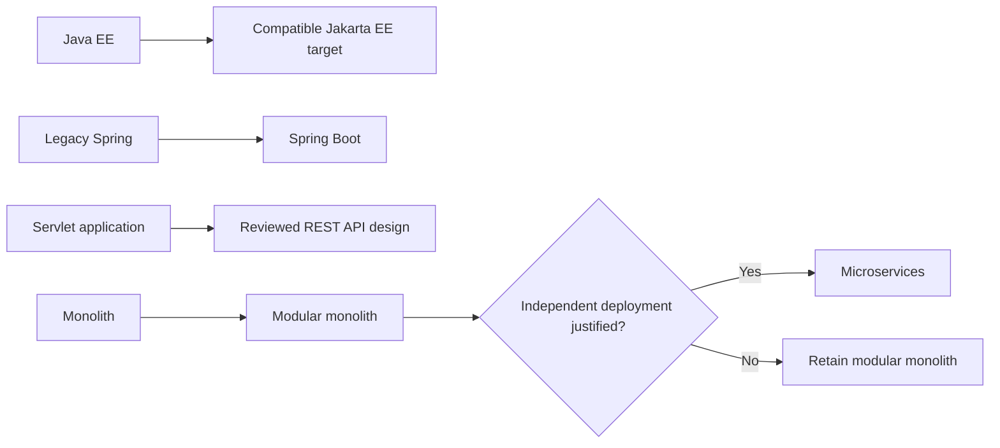

---

# 13. OpenRewrite

OpenRewrite can serve as a deterministic transformation engine.

Recommended architecture:

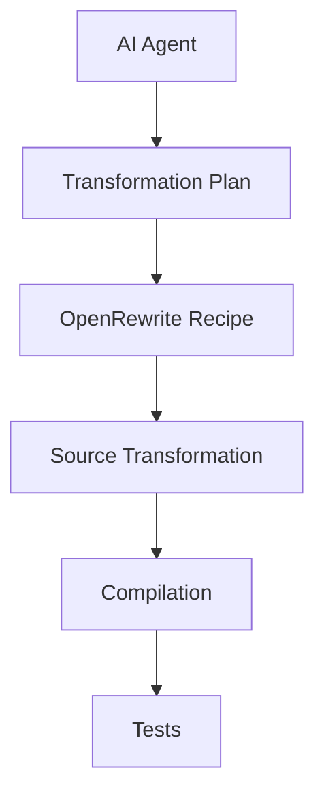

AI should generate or select transformations, while deterministic rewrite engines execute predictable source changes.

---

# 14. Testing Frameworks

Recommended:

- JUnit
- Mockito
- Testcontainers
- pytest
- Jest
- Playwright
- Cypress
- REST Assured

Testing strategy:

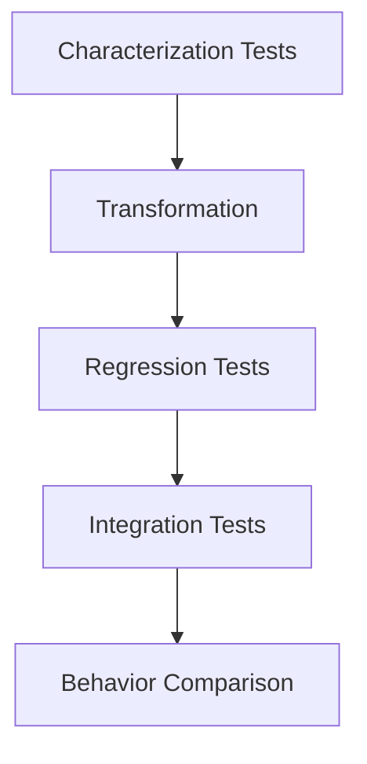

---

# 15. Containerization

Recommended:

- Docker
- Docker Compose
- Podman
- BuildKit
- OCI

Containers provide reproducible execution environments during migration.

---

# 16. Kubernetes

Potential deployment technologies:

- Kubernetes
- Helm
- Kustomize
- Argo CD
- Flux
- Istio

Modernization workloads can execute as isolated jobs:

```text
Kubernetes
│
├── Analysis Job
├── Architecture Job
├── Transformation Job
├── Compilation Job
├── Test Job
└── Validation Job
```

---

# 17. CI/CD

Recommended:

- GitHub Actions
- GitLab CI
- Jenkins
- Tekton
- Argo CD

Example pipeline:

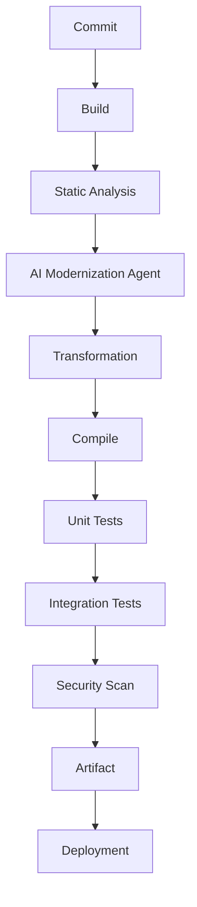

---

# 18. Security

Recommended technologies:

- Keycloak
- OAuth 2.0
- OpenID Connect
- HashiCorp Vault
- Azure Key Vault
- Trivy
- Semgrep
- CodeQL

AI modernization requires additional controls for:

- source-code confidentiality
- credentials
- secrets
- proprietary business logic
- dependency integrity
- generated-code validation

---

# 19. Observability

Recommended:

- OpenTelemetry
- Prometheus
- Grafana
- Jaeger
- Langfuse

AI-specific metrics:

```text
Agent Execution Time
Token Consumption
Model Latency
Transformation Success Rate
Compilation Success Rate
Test Success Rate
Rollback Rate
Human Approval Rate
```

---

# 20. Documentation and Architecture Modeling

Recommended:

- Mermaid
- PlantUML
- Draw.io
- Graphviz
- Structurizr
- SysML
- Arcadia
- Capella

The repository itself includes an `MBSE/CAS` structure and references Arcadia/Capella, CAD, CAM and CAS.

---

# Dependency Classification

Each dependency should receive one of these classifications:

| Type | Description |
|---|---|
| Core | Essential to the platform |
| Runtime | Required at execution time |
| Build | Required to compile |
| Development | Developer tooling |
| Test | Testing |
| AI | AI/LLM component |
| Agent | Agent orchestration |
| Analysis | Static/semantic analysis |
| Transformation | Code migration |
| Integration | External system |
| Infrastructure | Deployment |
| Security | Security |
| Observability | Monitoring |
| Research | Experimental |
| Reference | Comparative technology |
| Legacy | Compatibility |
| Deprecated | Not recommended |

---

# Dependency Specification Template

```yaml
name:
category:
dependency_type:

purpose:

repository:
official_website:

license:
license_compatibility:

programming_language:
version_tested:

installation:
runtime_requirements:
build_requirements:

api:
protocols:
data_formats:

input_formats:
output_formats:

integration:
ai_integration:
agent_integration:
rag_integration:
mbse_integration:

security_considerations:
privacy_considerations:

performance_considerations:
hardware_requirements:
operating_systems:

container_support:
kubernetes_support:

testing:
documentation:

status:
maintenance_status:
last_review:
```

---

# Dependency Matrix

| Technology | Category | Core | Main Purpose |
|---|---|---:|---|
| Frappe | Low-code / Runtime | Required in erp-low-code profile | Proposed forms, models and approval workflows; not installed or tested |
| OCA OpenUpgrade | ERP upgrade / Transformation | Odoo upgrade profile | Proposed version-specific Odoo upgrades; coverage must be qualified |
| LangGraph | Agent | Yes | Agent orchestration |
| AutoGen | Agent | Optional | Multi-agent workflows |
| OpenHands | Coding Agent | Optional | Autonomous coding |
| Haystack | AI/RAG | Optional | AI orchestration |
| Dify | AI Platform | Optional | LLM applications |
| Legacy2Modern | Modernization | Reference | Legacy migration |
| Going Merry | Modernization | Reference | Java migration |
| Coca | Modernization | Reference | Refactoring |
| DesigniteJava | Analysis | Recommended | Architecture analysis |
| OpenRewrite | Transformation | Recommended | Deterministic refactoring |
| JavaParser | Analysis | Recommended | Java parsing |
| Eclipse JDT | Analysis | Recommended | Java AST |
| Spoon | Analysis | Optional | Java transformation |
| SonarQube | Quality | Recommended | Code quality |
| Tree-sitter | Parsing | Recommended | Multi-language parsing |
| NetworkX | Graph | Recommended | Dependency graphs |
| Neo4j | Graph | Optional | Knowledge graph |
| Qdrant | RAG | Optional | Vector search |
| PostgreSQL | Data | Recommended | Metadata/state |
| Ollama | LLM | Optional | Local inference |
| vLLM | LLM | Optional | Production inference |
| Transformers | LLM | Recommended | Model integration |
| OpenRewrite | Transformation | Recommended | Source migration |
| JUnit | Testing | Recommended | Java testing |
| Testcontainers | Testing | Recommended | Integration testing |
| Docker | Infrastructure | Recommended | Containers |
| Kubernetes | Infrastructure | Production | Orchestration |
| Helm | Infrastructure | Recommended | Packaging |
| OpenTelemetry | Observability | Recommended | Telemetry |
| Prometheus | Observability | Recommended | Metrics |
| Grafana | Observability | Recommended | Dashboards |
| Langfuse | AI Observability | Optional | LLM tracing |

---

# Recommended Technology Stack

```yaml
platform:

  interface:
    - CLI
    - Web UI
    - IDE Plugin

  backend:
    - Python
    - FastAPI

  agent_orchestration:
    - LangGraph
    - AutoGen

  code_analysis:
    - Tree-sitter
    - JavaParser
    - Eclipse JDT
    - Spoon

  architecture_analysis:
    - DesigniteJava
    - ArchUnit
    - NetworkX
    - Graphviz

  transformation:
    - Rascal MPL (proposed AST / M3 normalization)
    - OpenRewrite
    - AST transformations
    - LLM-generated transformations

  llm:
    - Ollama
    - vLLM
    - Hugging Face Transformers

  code_models:
    - Qwen-Coder
    - DeepSeek-Coder
    - StarCoder
    - Code Llama

  knowledge:
    - PostgreSQL
    - Qdrant
    - Neo4j

  testing:
    - JUnit
    - Mockito
    - Testcontainers
    - pytest

  security:
    - Keycloak
    - OAuth2
    - OpenID Connect
    - Vault

  infrastructure:
    - Docker
    - Kubernetes
    - Helm

  observability:
    - OpenTelemetry
    - Prometheus
    - Grafana
    - Langfuse
```

---

# MBSE and Software Architecture

JFXLEGACY2MODERN can extend beyond source-code transformation toward **model-based modernization**.

The current project already contains an `MBSE/CAS` structure and references Arcadia, Capella, CAD, CAM and CAS.

## Model-Based Modernization

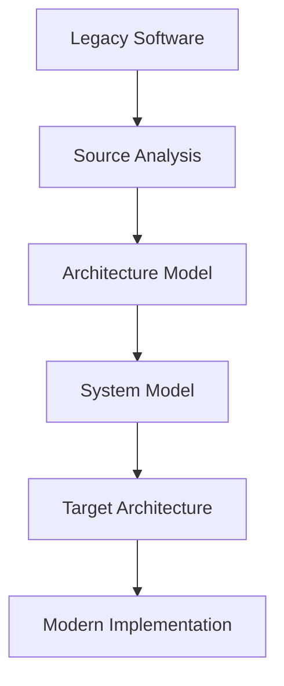

Potential models:

- UML
- SysML
- Arcadia
- AADL
- C4
- BPMN
- Architecture Decision Records

---

# Digital Engineering Integration

A future architecture may connect:

```mermaid
flowchart LR
    software["Software engineering"] --> platform["JFXLEGACY2MODERN"]
    platform --> mbse["MBSE"]
    platform --> cad["CAD"]
    platform --> cas["CAS"]
    mbse --> systems["System engineering constraints"]
    cad --> systems
    cas --> systems
```

This allows modernization decisions to consider not only source code but also system-level engineering constraints.

---

# User Guide

## Step 1 — Select a Legacy Repository

```bash
git clone <legacy-repository>
```

## Step 2 — Analyze the Repository

Run the discovery process:

```bash
legacy2modern analyze ./legacy-system
```

The system should identify:

- language
- framework
- build system
- dependencies
- architecture
- tests
- databases
- APIs

## Step 3 — Generate Architecture Report

```bash
legacy2modern architecture ./legacy-system
```

Expected output:

```text
architecture/
├── components.md
├── dependencies.graphml
├── call-graph.graphml
├── architecture.drawio
└── architecture-report.md
```

## Step 4 — Generate Modernization Plan

```bash
legacy2modern plan \
  --source legacy-java \
  --target spring-boot
```

## Step 5 — Generate Transformation

```bash
legacy2modern migrate \
  --source ./legacy \
  --target ./modern
```

## Step 6 — Execute Tests

```bash
legacy2modern validate ./modern
```

---

# Installation Guide

## Requirements

Recommended development environment:

```text
Operating System:
  Linux
  macOS
  Windows + WSL2

Version Control:
  Git

Languages:
  Python 3.x
  Java 17+

Build:
  Maven
  Gradle

Containers:
  Docker
  Docker Compose

Optional:
  Kubernetes
  NVIDIA GPU
```

Exact versions used for a release should be recorded in the dependency matrix before declaring a build reproducible.

---

# Installation

Clone the repository:

```bash
git clone https://github.com/sdk2035/jfxlegacy2modern.git
cd jfxlegacy2modern
```

Create the development environment:

```bash
python -m venv .venv
source .venv/bin/activate
```

Install dependencies:

```bash
pip install -r requirements.txt
```

Run the application:

```bash
python -m jfxlegacy2modern
```

If a Docker environment is provided:

```bash
docker compose up -d
```

---

# Docker Architecture

```text
jfxlegacy2modern/
│
├── frontend/
│
├── api/
│
├── agents/
│   ├── discovery/
│   ├── analysis/
│   ├── architecture/
│   ├── modernization/
│   ├── transformation/
│   ├── testing/
│   └── validation/
│
├── analyzers/
│
├── transformers/
│
├── knowledge/
│
├── models/
│
├── tests/
│
├── docker/
│
└── kubernetes/
```

---

# Kubernetes Deployment

A production deployment can execute modernization jobs independently.

```mermaid
flowchart LR
    subgraph control["Proposed cluster: control plane"]
        api["API"] --> orchestrator["Workflow orchestrator"]
    end
    subgraph workers["Isolated execution jobs"]
        analysis["Analysis"]
        transformation["Transformation"]
        tests["Build and validation"]
    end
    orchestrator --> analysis
    orchestrator --> transformation
    orchestrator --> tests
    orchestrator --> gateway["Model gateway"]
    orchestrator --> metadata[("PostgreSQL metadata")]
    orchestrator --> retrieval[("Retrieval store")]
    workers -.-> telemetry["Observability"]
```

## Job-Based Modernization

Each modernization request becomes a workflow:

```mermaid
flowchart TB
    n0["Modernization Request"]
    n1["Kubernetes Job"]
    n2["Analysis"]
    n3["Architecture"]
    n4["Planning"]
    n5["Transformation"]
    n6["Compilation"]
    n7["Testing"]
    n8["Validation"]
    n0 --> n1
    n1 --> n2
    n2 --> n3
    n3 --> n4
    n4 --> n5
    n5 --> n6
    n6 --> n7
    n7 --> n8
```

This approach allows multiple modernization projects to run independently.

---

# Security

Legacy source code can contain highly sensitive information.

Security controls should include:

- source isolation
- private model deployment
- encryption
- access control
- audit logs
- secrets management
- network isolation
- container scanning
- dependency scanning
- generated-code review

## Source Code Privacy

For confidential systems:

```mermaid
flowchart LR
    repo["Enterprise repository"] --> boundary["Private execution boundary"]
    boundary --> runtime["Isolated agent runtime"]
    runtime --> llm["Approved local model"]
    runtime --> db["Private retrieval store"]
```

External AI providers should only receive source code when explicitly authorized.

---

# AI Safety

AI-generated modernization must not be treated as automatically correct.

Every transformation should pass through:

```mermaid
flowchart TB
    n0["AI Proposal"]
    n1["Deterministic Transformation"]
    n2["Compilation"]
    n3["Automated Tests"]
    n4["Static Analysis"]
    n5["Human Review"]
    n6["Approval"]
    n0 --> n1
    n1 --> n2
    n2 --> n3
    n3 --> n4
    n4 --> n5
    n5 --> n6
```

---

# Testing and Validation

## Characterization Testing

Before migration:

```mermaid
flowchart TB
    n0["Legacy Application"]
    n1["Characterization Tests"]
    n2["Behavior Baseline"]
    n0 --> n1
    n1 --> n2
```

The baseline becomes the reference for the modern implementation.

## Regression Testing

```mermaid
flowchart LR
    suite["Shared scenarios and independent expected results"] --> legacy["Legacy execution"]
    suite --> modern["Modern execution"]
    legacy --> comparison["Compare outputs and side effects"]
    modern --> comparison
    comparison --> report["Differences and review evidence"]
```

## Semantic Validation

The system should compare:

- outputs
- exceptions
- database effects
- API responses
- state changes
- performance

---

# Modernization Quality Metrics

| Metric | Objective |
|---|---|
| Compilation Success | Build reliability |
| Test Pass Rate | Functional correctness |
| Code Coverage | Test quality |
| Complexity Reduction | Maintainability |
| Dependency Reduction | Technical debt |
| Vulnerability Reduction | Security |
| Duplication Reduction | Quality |
| Architecture Compliance | Target architecture |
| Transformation Success | Automation quality |
| Human Approval Rate | Trust |

---

# CI/CD

Recommended pipeline:

```mermaid
flowchart TB
    n0["Git Push"]
    n1["Static Analysis"]
    n2["Dependency Scan"]
    n3["AI Analysis"]
    n4["Modernization Plan"]
    n5["Transformation"]
    n6["Build"]
    n7["Unit Tests"]
    n8["Integration Tests"]
    n9["Security Tests"]
    n10["Architecture Validation"]
    n11["Human Approval"]
    n12["Release"]
    n0 --> n1
    n1 --> n2
    n2 --> n3
    n3 --> n4
    n4 --> n5
    n5 --> n6
    n6 --> n7
    n7 --> n8
    n8 --> n9
    n9 --> n10
    n10 --> n11
    n11 --> n12
```

---

# Repository Structure

Recommended structure:

```text
jfxlegacy2modern/
│
├── README.md
├── LICENSE
├── CONTRIBUTING.md
├── CODE-OF-CONDUCT.md
│
├── docs/
│   ├── architecture/
│   │   ├── adr/
│   │   ├── diagrams/
│   │   └── modernization/
│   │
│   ├── dependencies/
│   │   ├── software-compendium.md
│   │   └── dependency-matrix.csv
│   │
│   ├── agents/
│   ├── security/
│   └── testing/
│
├── src/
│   ├── api/
│   ├── agents/
│   │   ├── discovery/
│   │   ├── analysis/
│   │   ├── architecture/
│   │   ├── planning/
│   │   ├── transformation/
│   │   ├── testing/
│   │   └── validation/
│   │
│   ├── parsers/
│   ├── analyzers/
│   ├── transformers/
│   ├── models/
│   ├── knowledge/
│   └── security/
│
├── tests/
│   ├── unit/
│   ├── integration/
│   ├── characterization/
│   ├── transformation/
│   └── validation/
│
├── examples/
│   ├── java/
│   ├── spring/
│   ├── legacy/
│   └── modernization/
│
├── docker/
├── kubernetes/
└── helm/
```

---

# Architecture Decision Records

Modernization decisions should be documented.

Example:

```text
docs/architecture/adr/
├── ADR-001-agent-orchestration.md
├── ADR-002-intermediate-representation.md
├── ADR-003-code-transformation-engine.md
├── ADR-004-llm-provider.md
├── ADR-005-vector-database.md
├── ADR-006-modernization-testing.md
└── ADR-007-human-approval.md
```

Each ADR should include:

- Context
- Problem
- Decision
- Alternatives
- Consequences
- Security
- Operational impact

---

# Contribution

Contributions are welcome.

Typical contribution areas:

- source parsers
- language adapters
- framework migration recipes
- AI agents
- transformation engines
- test generation
- architecture analysis
- visualization
- MBSE integration
- documentation
- security

Recommended workflow:

```bash
git checkout -b feature/my-modernization-feature
```

Run tests:

```bash
pytest
```

Run static analysis:

```bash
ruff check .
```

Commit:

```bash
git commit -m "feat: add modernization analyzer"
```

Push:

```bash
git push origin feature/my-modernization-feature
```

Open a Pull Request.

---

# Code of Conduct

Contributors should:

- communicate respectfully
- provide constructive feedback
- protect confidential source code
- respect third-party licenses
- document AI-generated changes
- provide reproducible tests
- avoid introducing malicious transformations

The repository should maintain a `CODE-OF-CONDUCT.md` file.

---

# Authors

**Robotics Intelligent Systems**

Organization:

```text
https://github.com/robotics-intelligent-systems
```

Project:

```text
https://github.com/robotics-intelligent-systems/jfxlegacy2modern
```

Reference repository template:

```text
https://github.com/sdk2035/Plantilla-de-repositorio
```

---

# Additional Information

## Related Projects

JFXLEGACY2MODERN fits naturally into the broader Robotics Intelligent Systems software ecosystem.

```mermaid
flowchart TB
    ecosystem["Proposed AI engineering ecosystem"] --> arch["JFXAI4ARCH"]
    ecosystem --> nlp["JFXAI4NLP"]
    ecosystem --> modern["JFXLEGACY2MODERN"]
    arch -.-> modern
    nlp -.-> modern
```

### JFXAI4ARCH

Provides:

- AI agents
- RAG
- MCP
- model infrastructure
- cloud-native architecture

### JFXAI4NLP

Provides:

- NLP
- LLM
- natural-language programming
- language intelligence

### JFXLEGACY2MODERN

Provides:

- legacy analysis
- code modernization
- architecture recovery
- AI-assisted migration
- software transformation

---

# Strategic Architecture

The projects can converge toward an integrated architecture:

```mermaid
flowchart TB
    enterprise["Enterprise systems"] --> platform["JFXAI4ARCH: proposed AI platform"]
    platform --> nlp["JFXAI4NLP: language services"]
    platform --> agents["Agent orchestration / MCP"]
    platform --> modernization["JFXLEGACY2MODERN"]
    legacy["Legacy systems"] --> modernization
    nlp -.-> modernization
    agents -.-> modernization
```

---

# Modernization Maturity Model

JFXLEGACY2MODERN can implement five maturity levels.

## Level 1 — Discovery

```text
Repository Inventory
```

## Level 2 — Analysis

```text
Code + Dependency + Architecture Analysis
```

## Level 3 — Assisted Modernization

```text
AI Suggestions + Human Review
```

## Level 4 — Automated Modernization

```text
AI Agents + Deterministic Transformations
```

## Level 5 — Autonomous Engineering

```mermaid
flowchart TB
    n0["Discovery"]
    n1["Planning"]
    n2["Transformation"]
    n3["Testing"]
    n4["Validation"]
    n5["Deployment"]
    n0 --> n1
    n1 --> n2
    n2 --> n3
    n3 --> n4
    n4 --> n5
```

Human review is required before high-risk architectural changes and production deployment.

---

# Legacy-to-Modern Knowledge Graph

A long-term objective should be to maintain a knowledge graph connecting:

```text
Legacy Technology
      │
      ├── Version
      ├── API
      ├── Dependency
      ├── Vulnerability
      ├── Migration Recipe
      └── Modern Equivalent
```

Example:

```mermaid
flowchart LR
    legacy["Java EE 7"] --> servlet["Servlet API"]
    legacy --> jpa["JPA API"]
    servlet --> smap["Version-specific migration recipe"]
    jpa --> pmap["Version-specific migration recipe"]
    smap --> target["Jakarta Servlet target"]
    pmap --> persistence["Jakarta Persistence target"]
    namespace["Enterprise javax to jakarta only where required"] -.-> smap
    namespace -.-> pmap
```

This knowledge can become a reusable modernization asset.

---

# License

The project's actual license must be explicitly maintained in the repository's `LICENSE` file.

Third-party dependencies must be reviewed individually.

The dependency inventory should record:

- license
- version
- repository
- compatibility
- redistribution requirements
- commercial-use conditions
- model license
- documentation

The reference template specifically requires the README to identify the project's license and recommends keeping the complete license text in a root-level license file.

---

# Dependency Governance

For every production dependency, maintain:

```text
Name
Version
Purpose
License
Repository
Official Documentation
Runtime Requirements
Build Requirements
Security Status
Known Vulnerabilities
Container Support
Kubernetes Support
AI Integration
Maintenance Status
Last Review
```

Recommended files:

```text
docs/dependencies/software-compendium.md
docs/dependencies/dependency-matrix.csv
```

---

# Roadmap

## ERP Modernization and Low-Code Extension

- [x] ERP support, cross-product migration and 11→15 upgrade concept
- [x] Declarative erp-modernization and erp-low-code module specifications
- [x] Frappe dependency declaration and editable ERP architecture
- [ ] Immutable runtime revisions and per-hop compatibility matrices
- [ ] Odoo/ERPNext adapters, custom-module recipes and Frappe app
- [ ] Staging migrations, reconciliation, UAT and restore/rollback evidence
- [ ] Operational runbooks and accepted support handover

## Phase 1 — Repository Intelligence

- [ ] Repository discovery
- [ ] Language detection
- [ ] Build-system detection
- [ ] Dependency analysis
- [ ] Static analysis
- [ ] Architecture recovery

## Phase 2 — AI Modernization

- [ ] AI modernization planner
- [ ] Code transformation agents
- [ ] Framework migration agents
- [ ] Business rule extraction
- [ ] Test generation

## Phase 3 — Deterministic Transformation

- [ ] OpenRewrite integration
- [ ] AST transformation engine
- [ ] Migration recipes
- [ ] Compilation validation
- [ ] Automated rollback

## Phase 4 — Enterprise Modernization

- [ ] Private LLM infrastructure
- [ ] Enterprise repositories
- [ ] IAM integration
- [ ] Audit
- [ ] Governance
- [ ] Compliance

## Phase 5 — Autonomous Software Engineering

- [ ] Multi-agent modernization
- [ ] Architecture optimization
- [ ] Continuous technical-debt detection
- [ ] Automated modernization proposals
- [ ] Self-validating transformations
- [ ] Human-in-the-loop governance

---

# Conclusion

JFXLEGACY2MODERN can evolve from an AI-powered code migration tool into a complete **AI Software Modernization Engineering Platform**.

Its central architecture is:

```mermaid
flowchart LR
    legacy["Legacy system"] --> discovery["Discovery and code analysis"]
    discovery --> recovery["Architecture recovery and UML evidence"]
    recovery --> plan["Reviewed modernization plan"]
    plan --> change["Incremental transformation"]
    change --> tests["Build and behavior validation"]
    tests --> modern["Validated modern system"]
```

The strategic value of the platform is therefore not limited to generating new code. Its principal objective is to create a **traceable engineering process from legacy software discovery to validated modern architecture**, combining AI agents, deterministic transformations, software analysis, testing, architecture modeling and human governance.

---

## References

- JFXLEGACY2MODERN: https://github.com/robotics-intelligent-systems/jfxlegacy2modern
- Repository documentation template: https://github.com/sdk2035/Plantilla-de-repositorio
- Robotics Intelligent Systems: https://github.com/robotics-intelligent-systems