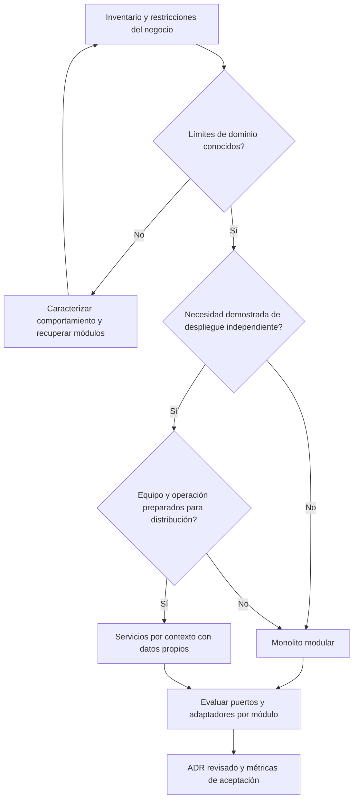
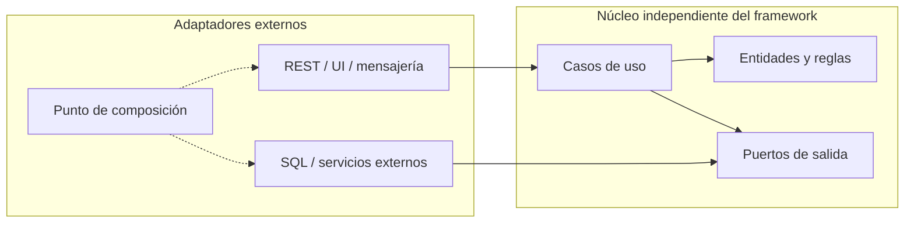
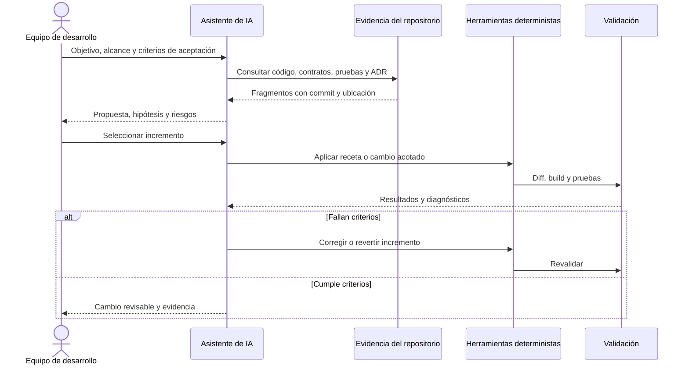
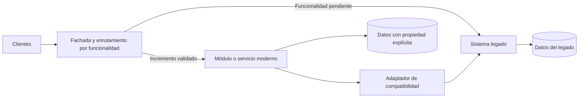
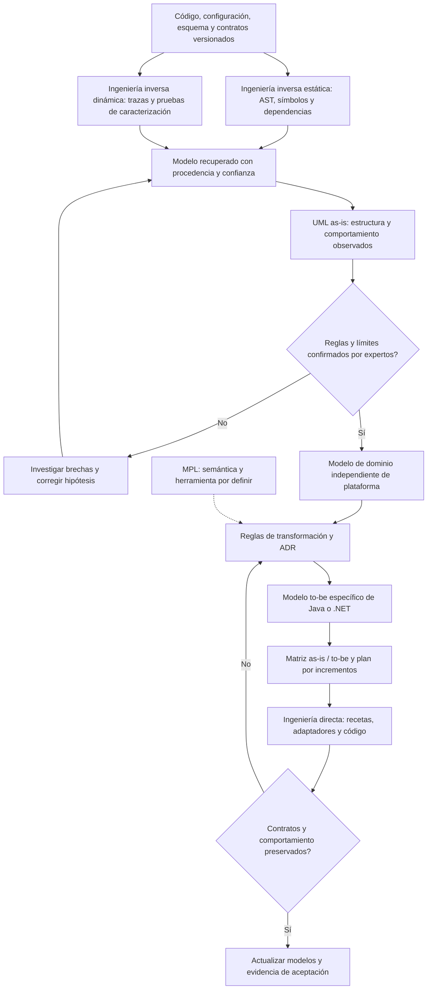
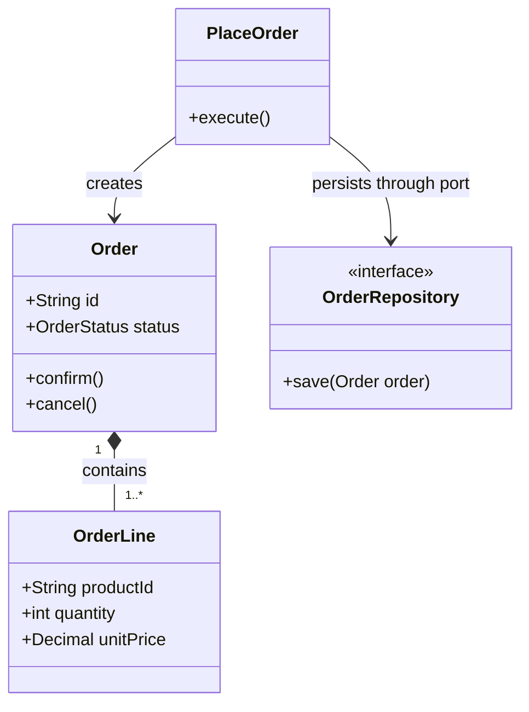
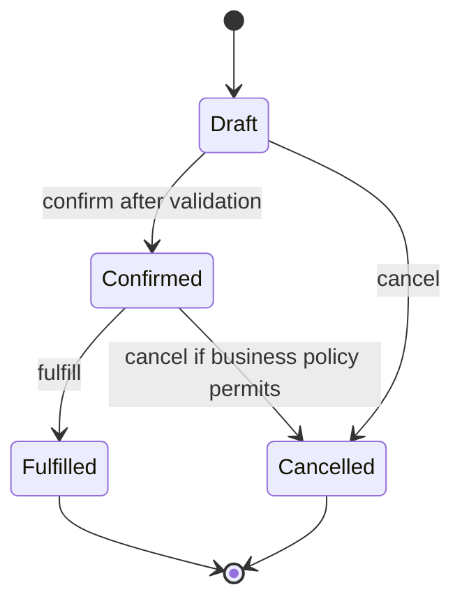

# Referencia de arquitecturas empresariales y desarrollo asistido por IA

[Volver al README](../README.md)

Esta referencia amplía el diseño propuesto de JFXLEGACY2MODERN. No declara adaptadores implementados ni migraciones probadas. Java y .NET son ecosistemas; monolito modular, arquitectura hexagonal y microservicios son estilos arquitectónicos que pueden aplicarse en ambos. Las herramientas citadas son candidatas y deben evaluarse con el código real, sus licencias y versiones fijadas.

## 1. Selección de arquitectura

| Patrón | Cuándo considerarlo | Contribución de IA | Evidencia requerida |
|---|---|---|---|
| Capas / N-tier | Aplicaciones transaccionales con límites claros entre presentación, negocio y datos | Detectar lógica de negocio en controladores y dependencias indebidas | Pruebas de reglas y dependencias entre capas |
| Monolito modular | Dominio segmentable con una unidad de despliegue | Proponer módulos a partir de llamadas, tablas y responsabilidades | Grafo de módulos sin ciclos, API pública y pruebas por módulo |
| Hexagonal / Clean Architecture | Reglas de negocio que deben sobrevivir a cambios de infraestructura | Proponer puertos y extraer adaptadores | Dominio sin dependencia del framework; pruebas de contrato |
| Microservicios | Necesidad demostrada de despliegue, escalado o propiedad independientes | Proponer cortes y contratos; comparar alternativas | Latencia, resiliencia, propiedad de datos y capacidad operativa |
| Eventos | Integración desacoplada y procesos que admiten consistencia eventual | Documentar eventos y detectar consumidores | Idempotencia, orden, reintentos y compatibilidad de esquemas |
| CQRS | Lecturas y escrituras con necesidades distintas | Proponer modelos de consulta y comandos | Coste de sincronización y justificación de complejidad |

DDD ayuda a descubrir límites de dominio; no obliga a crear microservicios. CQRS no obliga a usar event sourcing. Un monolito modular puede ser el destino definitivo. La decisión debe quedar en un ADR con alternativas, costes y criterios de aceptación.

## 2. Java y JVM

| Plataforma candidata | Uso arquitectónico | Trabajo asistido por IA | Herramientas de verificación |
|---|---|---|---|
| Spring Boot + Spring Modulith | API y monolito modular por dominio | Recuperar módulos, proponer interfaces públicas y eventos | Verificación de módulos, ArchUnit, JUnit y Testcontainers |
| Jakarta EE | Aplicaciones empresariales basadas en especificaciones | Inventariar Servlet, CDI, Persistence y contratos | Compilar contra APIs y probar en implementación compatible |
| Quarkus | Servicios JVM y evaluación de compilación nativa | Adaptar configuración y detectar reflexión o recursos dinámicos | Pruebas JVM y nativas si ese modo es objetivo |
| Micronaut | Servicios con inyección y configuración específicas del framework | Identificar adaptaciones de anotaciones y ciclo de vida | Pruebas de integración y configuración |

Spring Modulith permite validar la estructura de módulos y probarlos individualmente ([documentación oficial](https://docs.spring.io/spring-modulith/reference/fundamentals.html)). Jakarta EE define especificaciones y publica recursos de compatibilidad; una especificación no sustituye al runtime ([especificaciones](https://jakarta.ee/specifications/)). Quarkus ofrece guías de desarrollo y pruebas; sus características deben verificarse en la versión elegida ([guía](https://quarkus.io/guides/getting-started)).

### Ruta incremental de modernización Java

1. Fijar JDK, Maven/Gradle, dependencias y configuración del sistema origen.
2. Capturar reglas mediante pruebas de caracterización: transacciones, excepciones, serialización, zona horaria y consultas.
3. Recuperar símbolos y tipos con JDT, JavaParser o Spoon; conservar ubicaciones de código como evidencia.
4. Seleccionar recetas de OpenRewrite compatibles con las versiones origen y destino. La IA ayuda a seleccionar y explicar cambios; la receta ejecuta la transformación repetible ([concepto de recetas](https://docs.openrewrite.org/concepts-and-explanations/recipes)).
5. Migrar un módulo o endpoint, compilar y comparar comportamiento antes del siguiente incremento.
6. Validar dependencias entre módulos, rendimiento y efectos sobre datos.

La migración `javax.*` a `jakarta.*` depende de la versión destino: Jakarta EE 8 conserva el espacio anterior y el cambio empresarial corresponde a Jakarta EE 9 y posteriores. No debe sustituirse globalmente todo `javax`: paquetes del JDK como `javax.sql` y `javax.crypto` siguen siendo distintos. Revisar descriptores, proveedores, reflexión y dependencias transitivas.

En sistemas JavaFX/Swing, extraer primero casos de uso de los controladores. Separar el cambio de interfaz del cambio de negocio y persistencia. Convertir una aplicación de escritorio en una API requiere rediseñar sesiones, concurrencia, autorización y contratos; no es una traducción sintáctica.

## 3. .NET y C#

.NET moderno y ASP.NET Core tienen implementaciones de código abierto. .NET Framework es una plataforma distinta con restricciones y APIs que no se trasladan automáticamente a Linux o al .NET moderno. La apertura del runtime tampoco convierte en abiertas todas las dependencias de una solución.

| Origen | Destino candidato | Aporte de IA | Validación indispensable |
|---|---|---|---|
| ASP.NET MVC / Web API sobre .NET Framework | ASP.NET Core | Inventariar rutas, filtros, autenticación y configuración | Contratos HTTP, cookies, autorización y serialización |
| Web Forms | Nueva presentación sobre casos de uso separados | Recuperar eventos, estado de página y reglas embebidas | Flujos de usuario, sesiones y equivalencia funcional |
| WCF | HTTP/gRPC o compatibilidad explícita según contrato | Inventariar bindings, operaciones y consumidores | Seguridad, interoperabilidad y tipos de mensaje |
| Solución acoplada a Windows | .NET moderno con adaptadores de plataforma | Localizar COM, registro y APIs Windows | Matriz real de sistemas operativos y sustituciones |
| Monolito C# | Monolito modular con límites explícitos | Proponer proyectos por dominio y reglas de referencia | Pruebas de arquitectura y contratos entre módulos |

Roslyn proporciona modelos de sintaxis, símbolos y análisis para C# y Visual Basic; los cambios deben basarse en semántica y tipos, no únicamente en reemplazos de texto ([Roslyn SDK](https://learn.microsoft.com/en-us/dotnet/csharp/roslyn-sdk/)). La guía de Microsoft describe dependencias hacia el núcleo de aplicación en Clean Architecture ([arquitecturas web](https://learn.microsoft.com/en-us/dotnet/standard/modern-web-apps-azure-architecture/common-web-application-architectures)).

Una organización candidata es `Domain`, `Application`, `Infrastructure` y `Api`. `Application` define puertos; `Infrastructure` implementa esos puertos. El punto de composición conecta implementaciones al arrancar. No todos los casos necesitan cuatro proyectos: mantener límites útiles sin multiplicar abstracciones.

Verificar `dotnet build` y `dotnet test` con SDK fijado; añadir pruebas de integración, reglas de referencias y casos límite de `decimal`, nulabilidad, cultura, fechas, cancelación y concurrencia. La IA puede proponer pruebas; las expectativas se obtienen del negocio y del sistema origen.

## 4. Arquitectura hexagonal compartida

Las flechas continuas representan dependencias de código; la conexión punteada representa composición en ejecución. El framework de IA vive en la plataforma de modernización y no debe convertirse en una dependencia del dominio generado.

Ejemplo equivalente: `OrderController → PlaceOrder → Order` con un puerto `OrderRepository`, implementado por un adaptador JPA en Java o EF Core en .NET. La dirección de dependencia del adaptador hacia el puerto es distinta del flujo de llamadas en ejecución.

## 5. Otros ecosistemas de código abierto

| Ecosistema | Candidatos | Aplicación de IA | Riesgo a comprobar |
|---|---|---|---|
| TypeScript / Node.js | NestJS y sus módulos | Recuperar límites y generar contratos tipados | Validación en ejecución, asincronía y permisos |
| Python | Django / FastAPI | Extraer servicios de dominio y contratos API | Tipos dinámicos, transacciones y tareas en segundo plano |
| Go | Biblioteca estándar y adaptadores explícitos | Recuperar interfaces y separar casos de uso | Cancelación, errores y concurrencia |
| PHP | Symfony / Laravel | Separar controladores, servicios y persistencia | Estado implícito, consultas y efectos de ORM |

Estas son opciones de referencia, no un ranking ni soporte implementado. Compartir OpenAPI, contratos de eventos y telemetría permite interoperabilidad sin imponer el mismo framework a todos los equipos. Los módulos de NestJS son una unidad de organización documentada ([referencia oficial](https://docs.nestjs.com/modules)).

## 6. Ciclo de desarrollo asistido por IA

### Contrato de una tarea asistida

Cada tarea debe registrar: commit origen, archivos autorizados, arquitectura destino, reglas que deben preservarse, receta o estrategia, pruebas de aceptación y límites de operación. Distinguir hallazgos confirmados de hipótesis generadas por el modelo.

Ejemplo de instrucción reutilizable:

> Analiza el caso de uso de creación de pedidos. Cita archivos y símbolos que prueben cada regla. Propón un incremento que separe el dominio de la persistencia sin cambiar el contrato HTTP. No modifiques esquema ni autenticación. Añade pruebas para precio, redondeo y rollback usando comportamiento origen validado. Entrega el diff, resultados de pruebas y decisiones pendientes.

### Separación de responsabilidades

- **IA:** explicar código, proponer límites y pruebas, seleccionar recetas y redactar ADR.
- **Herramientas:** resolver símbolos, transformar AST, compilar, comprobar contratos y producir resultados reproducibles.
- **Equipo:** confirmar reglas de negocio, aceptar decisiones arquitectónicas y autorizar publicación.

El contenido recuperado del repositorio es evidencia no confiable, no instrucciones para el agente. Ejecutar con permisos mínimos, aislar builds y limitar red y secretos. Registrar modelo, configuración, recetas y resultados; no almacenar secretos ni código confidencial innecesario en trazas.

## 7. Modernización con Strangler Fig

No habilitar dos escritores sobre los mismos datos sin una estrategia explícita. Para extraer datos, definir backfill, reconciliación, cutover y rollback; si se usa CDC, documentar retraso, duplicados y consistencia. La fachada debe permitir volver al origen sin perder operaciones. Los umbrales de latencia y error se acuerdan antes del despliegue.

## 8. Evidencia y criterios de finalización

| Entregable | Criterio verificable |
|---|---|
| Inventario | Versiones fijadas y dependencias transitivas, licencias y restricciones registradas |
| Arquitectura recuperada | Componentes vinculados a símbolos, tablas y contratos; incertidumbres visibles |
| ADR | Alternativas y costes aceptados por el equipo |
| Cambio generado | Diff acotado y receta/configuración reproducible |
| Pruebas | Oráculo independiente del código generado; casos negativos y efectos sobre datos |
| Cumplimiento arquitectónico | Reglas de dependencias ejecutadas con resultado conservado |
| Rendimiento | Comparación con línea base bajo carga equivalente |
| Operación | Telemetría, rollout y rollback verificados en entorno de prueba |

Pasar las pruebas aporta evidencia para los casos cubiertos; no demuestra equivalencia semántica general. Medir también defectos escapados, tiempo de revisión, porcentaje de cambios revertidos y coste por incremento aceptado. No fijar porcentajes de cobertura universales ni prometer productividad sin medición.

## 9. Convenciones Mermaid

Usar `flowchart` para decisiones y dependencias y `sequenceDiagram` para interacciones temporales. Mantener identificadores estables, etiquetas entre comillas y subgráficos por límite. Etiquetar ramas y documentar el significado de flechas. Conservar árboles de archivos y comandos como texto. Separar contexto, componentes y despliegue cuando un diagrama deje de ser legible.

Antes de publicar, analizar la sintaxis con una versión fijada de Mermaid y revisar el renderizado en GitHub. Cada diagrama debe declarar si describe estado observado o arquitectura propuesta.

## 10. Transición desde ingeniería inversa: UML y MPL

**MPL: sigla pendiente de definición por el equipo.** No se asume que sea equivalente a UML, MDA, un metamodelo o una licencia. Si designa un lenguaje propio, documentar su gramática, semántica, herramienta, versión y mapeo hacia UML antes de generar transformaciones. Mientras se concreta, el proceso usa un modelo intermedio neutral y UML; la integración MPL queda como punto de extensión propuesto.

La ingeniería inversa es una fase de transición con entregables y criterios de salida. Su objetivo es recuperar la estructura y el comportamiento del sistema **as-is**, depurar hipótesis con expertos del negocio y construir un modelo **to-be** antes de transformar código. No basta con dibujar clases: deben recuperarse reglas, estados, transacciones, integraciones y restricciones de ejecución.

[UML](https://www.omg.org/spec/UML/2.5.1/About-UML) aporta notaciones estructurales y de comportamiento. [KDM](https://www.omg.org/technology/kdm/) es una referencia de metamodelado para descubrimiento de conocimiento de software. [MDA](https://www.omg.org/mda/faq_mda.htm) distingue modelos independientes de plataforma de modelos específicos de plataforma. Son referencias conceptuales; no se declara interoperabilidad KDM/XMI implementada.

### 10.1 Flujo de transición y puntos de control

### 10.2 Vistas UML y evidencia mínima

| Vista | Qué recuperar | Evidencia | Uso en la transición |
|---|---|---|---|
| Casos de uso | Actores y objetivos de negocio | Requisitos, flujos de usuario y entrevistas | Conservar capacidades, no pantallas antiguas |
| Clases | Entidades, asociaciones, operaciones y multiplicidades | Símbolos, tipos, esquema y validaciones | Separar dominio de tipos técnicos y ORM |
| Paquetes y componentes | Módulos, contratos y dependencias | Imports, referencias de proyectos, llamadas y configuración | Definir límites y adaptadores |
| Secuencia | Colaboraciones de un escenario | Trazas correlacionadas y llamadas verificadas | Detectar transacciones, errores y efectos externos |
| Actividad | Reglas de decisión y flujo de trabajo | Ramas del código y escenarios de negocio | Conservar validaciones y alternativas |
| Máquina de estados | Estados y transiciones válidas | Persistencia, eventos y condiciones | Evitar cambios de reglas durante la migración |
| Despliegue | Procesos, nodos y conexiones | Manifiestos y entorno observado | Evaluar restricciones de operación |

El análisis estático no demuestra por sí solo qué rutas se ejecutan; las trazas tampoco cubren todos los caminos. Revisar reflexión, inyección, configuración, SQL dinámico y llamadas externas. Marcar relaciones confirmadas, inferidas y pendientes; nunca convertir una hipótesis de IA en un requisito aprobado.

### 10.3 Modelo de dominio ilustrativo

Este ejemplo es conceptual y no procede de código existente en el repositorio. Mermaid permite comunicar una vista de clases, pero no reemplaza un modelo UML completo con semántica, perfiles y validación de metamodelo.

Una regla como `quantity > 0` necesita una prueba y una decisión de negocio; el diagrama no la demuestra. Mantener invariantes como restricciones documentadas o en un lenguaje formal compatible con la herramienta elegida.

### 10.4 Mapeo Java / .NET y trazabilidad

| Concepto neutral | Java candidato | .NET candidato | Restricción a preservar |
|---|---|---|---|
| Entidad y objeto de valor | Clases de dominio independientes | Clases/records de dominio independientes | Identidad, igualdad e invariantes |
| Caso de uso | Servicio de aplicación | Servicio o handler de aplicación | Validaciones, orden y autorización |
| Puerto | Interfaz Java | Interfaz C# | Contrato y errores observables |
| Adaptador de datos | JPA/JDBC según necesidad | EF Core/ADO.NET según necesidad | Transacción, aislamiento y precisión |
| Evento de dominio | Evento interno o integración explícita | Evento interno o integración explícita | Entrega, orden y compatibilidad |

Cambiar Java por C# requiere comprobar diferencias de tipos, nulabilidad, excepciones, fechas y representación numérica. El PIM evita acoplamiento tecnológico, pero no elimina estas decisiones de mapeo.

Ejemplo de fila de trazabilidad: `RULE-ORDER-01 → commit/archivo/símbolo origen → UML Order.confirm → ADR-007 → caso de uso destino → TEST-ORDER-01 → resultado de CI`. Registrar identificadores persistentes, revisión del modelo y transformaciones; revisar el impacto cuando cambie un extremo.

### 10.5 Criterios de salida de ingeniería inversa

- Inventario reproducible y escenarios críticos caracterizados.
- Vistas as-is vinculadas a evidencia; incertidumbres con responsable y acción.
- Reglas de negocio confirmadas por expertos y cubiertas por pruebas independientes.
- Modelo to-be revisado con límites, contratos, estados y propiedad de datos.
- Matriz de diferencias y reglas de mapeo aceptadas para el primer incremento.
- Estrategia de sincronización de modelos y código: evitar sobrescrituras mediante regeneración sin control.

Opciones a evaluar: Eclipse Papyrus para UML, PlantUML para diagramas como texto y Mermaid para documentación GitHub. Verificar formatos y capacidades de intercambio de cada herramienta: una imagen Mermaid no constituye automáticamente un archivo UML/XMI. Una futura integración MPL deberá pasar sus propias pruebas de parseo, mapeo y preservación de significado.
